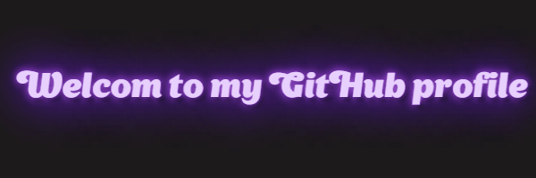

  
  <h1>Hi there! 👋 I'm <strong>Ilya</strong></h1>
  
🚀 Developer | 📚️ Mathematician | 💡 Problem Solver

## 📜 About Me
- 🔭 I’m currently working on **[my CourseWork](https://github.com/safronCode/amcp_GTaOR)**
- 🌱 I’m currently learning **Django framework**
- 💬 Ask me about **Math**
- ⚡ Fun fact: **My superpower is to write code that works, although I do not know why)**

---

## 🛠️ Tech Stack

  
  
  
---

## 🌐 Connect with Me

  

---

## 🏆 Highlights
- 👩‍💻 Open-source enthusiast.
- 🌟 Comimg soon... 
---

⭐ **Feel free to star my repositories if you find them helpful!**
